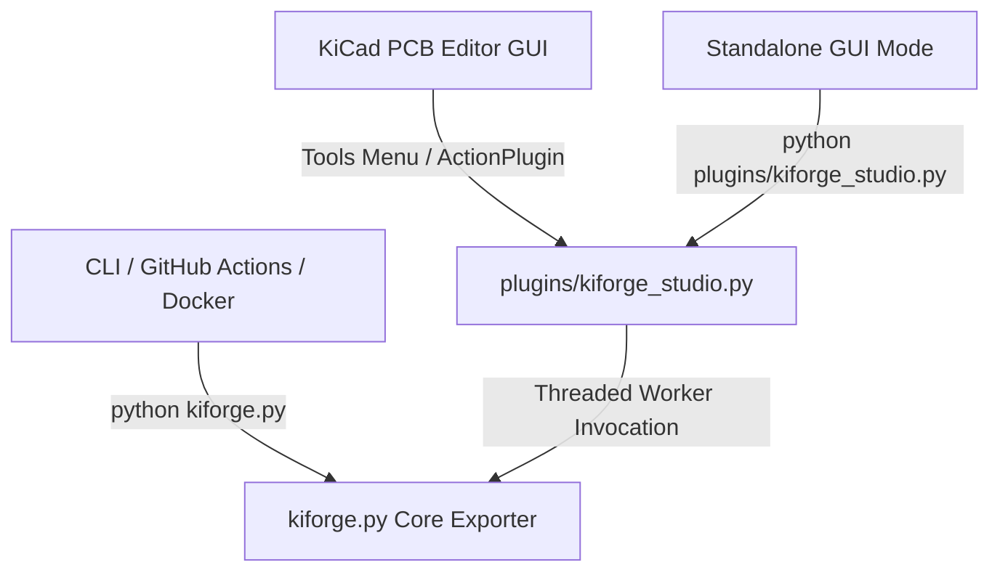

# KiForge Architecture & Developer Guide

This document describes the internal architecture of **KiForge**, its design patterns, processing lifecycle, and execution pipeline. It is intended for developers who wish to modify, extend, or debug the exporter.

---

## 1. System Overview

KiForge is designed as a unified manufacturing and documentation exporter for KiCad 10 projects. It operates under a single-source-of-truth model, where a single core Python module (`kiforge.py`) contains all resolution, validation, task formatting, and CLI parsing logic.

There are three primary entry points into the system:



1. **KiCad GUI ActionPlugin**: Invoked via `plugins/kiforge_studio.py` within the KiCad PCB Editor. It runs the export pipeline in a background worker thread while providing a modal, responsive `wx.ProgressDialog` on the main GUI thread.
2. **Standalone GUI Mode**: Runs as a standard desktop application for local testing when launched directly.
3. **CLI & CD Composite Action**: Run headlessly in terminal environments or inside Docker containers (such as the official `kicad/kicad:10.0` container) in GitHub Actions pipelines.

---

## 2. Design Patterns & Principles

KiForge is structured using seasoned object-oriented design patterns to keep the exporter clean, extensible, and robust:

### A. Command / Task Pattern (`ExportTask`)
Each export step (e.g., Gerber generation, drill plotting, BOM formatting) is isolated into a subclass of the abstract `ExportTask`. 
* **Single Responsibility**: Each task defines only how to check its own applicability and how to run its specific exporter command.
* **Separation of Concerns**: Task orchestration is decoupled from execution details, making it trivial to add or disable new export tasks.

### B. Context Object Pattern (`ExportContext`)
All execution state—such as resolved executable paths, project files, user-supplied option flags, the structured logger instance, and the thread-safe process lock—is encapsulated in a single `ExportContext` instance.
* **Thread-Safety**: Prevents mutable globals from colliding across multiple executions in the same KiCad process.
* **Traceability**: All tasks query the context object to resolve output directories or inspect state.

### C. Facade Pattern (`run_export`)
The `run_export` function acts as a backwards-compatible facade that accepts configuration parameters or an `ExportContext` and routes execution through the OOP `ExportRunner` pipeline.

---

## 3. The Execution Lifecycle

The execution of a KiForge run follows a deterministic, sequential lifecycle:

```mermaid
sequenceDiagram
    participant User as Entry Point (CLI/GUI)
    participant Context as ExportContext
    participant Runner as ExportRunner
    participant Task as ExportTask
    participant Formatter as JLCPCBFormatter

    User->>Context: Instantiate(project_path, options)
    User->>Context: resolve()
    Note over Context: 1. Resolves kicad-cli / python paths<br/>2. Locates .kicad_pcb & .kicad_sch<br/>3. Merges settings & rotation offsets<br/>4. Appends version to pcb_name
    Context-->>User: Success (bool)
    
    User->>Runner: Instantiate(context)
    Note over Runner: Populates task list pipeline
    User->>Runner: execute()
    
    loop For each applicable Task
        Runner->>Task: is_applicable(context)
        Task-->>Runner: True/False
        alt Task is applicable
            Runner->>Task: run(context)
            Note over Task: Spawns subprocess (kicad-cli or iBOM)
            Task-->>Runner: True (Success)
        end
    end
    
    Note over Runner: Post-Processing Steps
    Runner->>Task: BomOutputTask / PosOutputTask
    Note over Task: Rename raw CSVs; optional JLCPCBFormatter
    
    Runner-->>User: Pipeline Complete (bool)
```

### Phase 1: Context Resolution
The `ExportContext.resolve()` method performs all environment discovery:
1. **Executable Resolution**: Finds `kicad-cli` and `kicad-python` (with `pcbnew` bound) standard paths across Windows, macOS, and Linux using `PathResolver`.
2. **Subprocess Environment**: Builds `PYTHONPATH` and `PATH` via `_build_subprocess_env()`. iBOM-specific env flags are **not** applied here — only in `ensure_ibom_subprocess_env()` when launching InteractiveHtmlBom.
3. **File Discovery**: Recursively searches the `project_path` to find `.kicad_pcb`, `.kicad_pro`, and `.kicad_sch` files.
4. **Settings Merging**: Loads global settings (`~/.config/kiforge/settings.json` on Linux), project-local `.kiforge.json`, and merges them with run-time command flags (command line or GUI).
5. **Version Suffix**: Resolved by `resolve_export_version()` — explicit option → `GITHUB_REF_NAME` → `VERSION` env → git tag → `v0.1.0`. Appended to `pcb_name` for all versioned outputs.
6. **Rotation Offsets**: Loaded through `load_merged_settings()` from `.kiforge.json`; runtime options override project values.

Schematic PDF export optionally writes `(rev …)` into a staged schematic copy so the source file is not modified (`sync_title_block_rev` runtime flag).

### Phase 2: Pipeline Initialization
`ExportRunner` builds an ordered task pipeline consisting of two parts:
1. **CLI Core Exporters**: Runs `kicad-cli` commands to generate raw Gerbers, drills, positions, BOMs, schematic PDFs, STEP models, 3D renders, SVGs, and Interactive HTML BOMs.
2. **Post-Processors**:
   - `GerberPackTask` — zip `temp_gerbers/` into `{name}_gerbers.zip`
   - `BomOutputTask` — rename `raw_bom.csv` → `{name}_bom.csv`; optionally `{name}_bom_jlc.csv`
   - `PosOutputTask` — rename `raw_pos.csv` → `{name}_pos.csv`; optionally `{name}_cpl_jlc.csv`

Raw BOM and placement files are kept; JLC variants are additional outputs when `format_jlc` is enabled.

### Phase 3: Task Execution & Subprocess Tracking
Each task executes its logic inside `run()`, typically invoking `_run_subprocess()`.
* **Process Tracking**: The spawned `subprocess.Popen` object is atomically assigned to `context.active_process` under a thread lock (`context._lock`).
* **Output Redirection**: Subprocess `stdout` and `stderr` are read and written to the structured logger (`kiforge.log`) at the `DEBUG` level for traceability.
* **Resilience**: A failed step adds a warning and the pipeline continues unless every applicable step fails or the user cancels.

---

## 4. Thread-Safe GUI Background Processing

Running heavy CLI export processes directly on a GUI thread freezes the window manager, leading to "Not Responding" application hangs. KiForge Studio solves this by splitting GUI polling and worker threads safely:

* **Background Worker Thread**: Invokes `kiforge.run_export(context)` and runs the pipeline.
* **Progress GUI Thread**: Polls worker state and updates `wx.ProgressDialog` only when progress text or value changes (avoids Linux/Windows flicker from tight `wx.SafeYield()` loops).
* **Thread-Safe Cancellation**: If the user clicks "Cancel" on the progress dialog, the GUI thread calls `context.cancel()`. The worker thread checks `context.is_aborted()` at each task boundary, locks `context._lock`, and terminates/kills the active `subprocess.Popen` instance immediately.

Studio also debounces CD workflow regeneration when export checkboxes change (`_schedule_cd_sync` / `_sync_cd_workflows_silent`).

---

## 5. Standalone & KiCad Environment Bridging

KiCad's internal scripting environment has unique constraints:
* **Conditional Class Definition**: Action plugins must extend `pcbnew.ActionPlugin`. However, when importing classes for unit tests or running in standalone mode, `pcbnew` is unavailable. KiForge resolves this dynamically:
  ```python
  _PluginBase = pcbnew.ActionPlugin if has_pcbnew else object

  class ExporterPlugin(_PluginBase):
      ...
  ```
* **Safe Import Registration**: The plugin registration hook must run only when KiCad scans python files on startup. To prevent C++ assertions when running tests or CLI, `plugins/__init__.py` utilizes a strict environment check:
  ```python
  if 'pcbnew' in sys.modules:
      from .kiforge_studio import ExporterPlugin
      ExporterPlugin().register()
  ```
* **iBOM toolbar coexistence**: `INTERACTIVE_HTML_BOM_CLI_MODE` and `INTERACTIVE_HTML_BOM_NO_DISPLAY` must never be set at `kiforge.py` import time — only in `ensure_ibom_subprocess_env()` for the iBOM export subprocess. Setting them globally breaks the standalone InteractiveHtmlBom plugin toolbar in KiCad.

---

## 6. JLCPCB Standardizations

### BOM Filtering (`JLCPCBFormatter.format_bom`)
* Ignores components marked with `DNP` (Do Not Populate) fields.
* Standardizes columns into: `Designator`, `Comment`, `Footprint`, `LCSC`, and `Quantity`.
* Automatically maps multiple common custom field names (e.g. `LCSC Part #`, `JLCPCB Part`) to the unified `LCSC` column.

### CPL Rotation Offsets (`JLCPCBFormatter.format_cpl`)
* Converts raw position layouts into `Designator`, `Mid X`, `Mid Y`, `Layer`, and `Rotation`.
* Downstream manufacturers like JLCPCB use standard component feeders that require specific rotational alignment relative to KiCad's CAD layout orientation.
* KiForge applies footprint package patterns and component designators against `rotation_offsets` from merged settings (`.kiforge.json` or runtime options):
  ```python
  rotation = (rotation + offset) % 360.0
  ```
* **Optional formatting**: Set `format_jlc: false` in settings or pass `--no-format-jlc` on the CLI to skip JLCPCB BOM/CPL post-processing while still keeping raw `{name}_bom.csv` and `{name}_pos.csv`.

---

## 7. Settings & Gitignore Template

KiForge settings merge in this order: built-in defaults → global file → project `.kiforge.json` → runtime GUI/CLI flags.

| Scope | Location |
| --- | --- |
| Global | `~/.config/kiforge/settings.json` (Linux), `%APPDATA%/kiforge/settings.json` (Windows) |
| Project | `<project>/.kiforge.json` |

Saved JSON structure:

```json
{
  "output_dir": "kiforge",
  "exports": { "export_gerbers": true, "format_jlc": true, "generate_cd": true, ... },
  "ibom": { "include_tracks": false, "dark_mode": false, ... },
  "rotation_offsets": { "0603": 90 }
}
```

Legacy flat export keys and `generate_ci` are still read for backward compatibility.

CD workflow generation and `.gitignore` updates read editable files from `templates/` (shipped beside the installed `kiforge.py` in the plugin zip). Edit `templates/kiforge.gitignore`, `templates/github-release.yml`, and `templates/gitea-release.yml` in the repo — never duplicate them under `plugins/templates/` in git.

When Gerbers are enabled, drill export runs automatically so the Gerber ZIP always includes drill files. JLC formatting (`format_jlc`) and CD generation (`generate_cd`) default to on and can be disabled per run or in saved settings.

Schematic title-block `(rev …)` sync is an export-runtime option (CLI / Studio Run Export / GitHub Action), not a saved setting. Studio auto-saves project config after a successful export.
