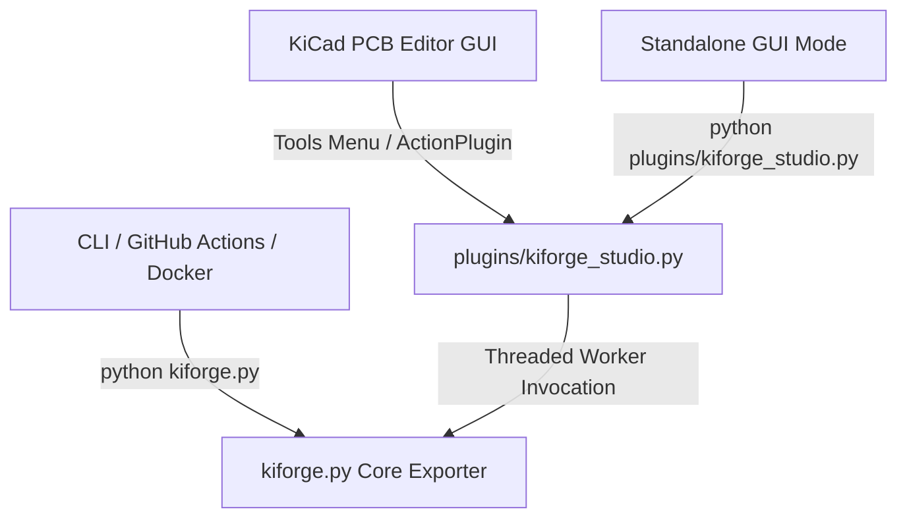

# KiForge Architecture & Developer Guide

This document describes the internal architecture of **KiForge**, its design patterns, processing lifecycle, and execution pipeline. It is intended for developers who wish to modify, extend, or debug the exporter.

---

## 1. System Overview

KiForge is designed as a unified manufacturing and documentation exporter for KiCad 10 projects. It operates under a single-source-of-truth model, where a single core Python module (`kiforge.py`) contains all resolution, validation, task formatting, and CLI parsing logic.

There are three primary entry points into the system:



1. **KiCad GUI ActionPlugin**: Invoked via `plugins/kiforge_studio.py` within the KiCad PCB Editor. It runs the export pipeline in a background worker thread while providing a modal, responsive `wx.ProgressDialog` on the main GUI thread.
2. **Standalone GUI Mode**: Runs as a standard desktop application for local testing when launched directly.
3. **CLI & CD Composite Action**: Run headlessly in terminal environments or inside Docker containers (such as the official `kicad/kicad:10.0` container) in GitHub Actions pipelines.

---

## 2. Design Patterns & Principles

KiForge is structured using seasoned object-oriented design patterns to keep the exporter clean, extensible, and robust:

### A. Command / Task Pattern (`ExportTask`)
Each export step (e.g., Gerber generation, drill plotting, BOM formatting) is isolated into a subclass of the abstract `ExportTask`. 
* **Single Responsibility**: Each task defines only how to check its own applicability and how to run its specific exporter command.
* **Separation of Concerns**: Task orchestration is decoupled from execution details, making it trivial to add or disable new export tasks.

### B. Context Object Pattern (`ExportContext`)
All execution state—such as resolved executable paths, project files, user-supplied option flags, the structured logger instance, and the thread-safe process lock—is encapsulated in a single `ExportContext` instance.
* **Thread-Safety**: Prevents mutable globals from colliding across multiple executions in the same KiCad process.
* **Traceability**: All tasks query the context object to resolve output directories or inspect state.

### C. Facade Pattern (`run_export`)
The `run_export` function acts as a backwards-compatible facade that accepts configuration parameters or an `ExportContext` and routes execution through the OOP `ExportRunner` pipeline.

---

## 3. The Execution Lifecycle

The execution of a KiForge run follows a deterministic, sequential lifecycle:

```mermaid
sequenceDiagram
    participant User as Entry Point (CLI/GUI)
    participant Context as ExportContext
    participant Runner as ExportRunner
    participant Task as ExportTask
    participant JLC as JlcFormatTask

    User->>Context: Instantiate(project_path, options)
    User->>Context: resolve()
    Note over Context: 1. Resolves kicad-cli / python paths<br/>2. Locates .kicad_pcb & .kicad_sch<br/>3. Merges settings & rotation offsets<br/>4. Appends version to pcb_name
    Context-->>User: Success (bool)
    
    User->>Runner: Instantiate(context)
    Note over Runner: Populates task list pipeline
    User->>Runner: execute()
    
    loop For each applicable Task
        Runner->>Task: is_applicable(context)
        Task-->>Runner: True/False
        alt Task is applicable
            Runner->>Task: run(context)
            Note over Task: Spawns subprocess (kicad-cli or iBOM)
            Task-->>Runner: True (Success)
        end
    end
    
    Note over Runner: Post-Processing Steps
    Runner->>Task: BomOutputTask / PosOutputTask / JlcFormatTask
    Note over Task: Version KiCad CSVs; optional JLC copies via JLCPCBFormatter
    
    Runner-->>User: Pipeline Complete (bool)
```

### Phase 1: Context Resolution
The `ExportContext.resolve()` method performs all environment discovery:
1. **Executable Resolution**: Finds `kicad-cli` and `kicad-python` (with `pcbnew` bound) standard paths across Windows, macOS, and Linux using `PathResolver`.
2. **Subprocess Environment**: Builds `PYTHONPATH` and `PATH` via `_build_subprocess_env()`. iBOM-specific env flags are **not** applied here — only in `ensure_ibom_subprocess_env()` when launching InteractiveHtmlBom.
3. **File Discovery**: Recursively searches the `project_path` to find `.kicad_pcb`, `.kicad_pro`, and `.kicad_sch` files.
4. **Settings Merging**: Loads global settings (`~/.config/kiforge/settings.json` on Linux), project-local `.kiforge.json`, and merges them with run-time command flags (command line or GUI).
5. **Version Suffix**: Resolved by `resolve_export_version()` — explicit option → `GITHUB_REF_NAME` → `VERSION` env → git tag → `v0.1.0`. Appended to `pcb_name` for all versioned outputs.
6. **Rotation Offsets**: Loaded through `load_merged_settings()` from `.kiforge.json`; runtime options override project values.

Schematic PDF export optionally writes `(rev …)` into a staged schematic copy so the source file is not modified (`sync_title_block_rev` runtime flag).

### Phase 2: Pipeline Initialization
`ExportRunner` builds an ordered task pipeline consisting of two parts:
1. **CLI Core Exporters**: Runs `kicad-cli` commands to generate raw Gerbers, drills, positions, BOMs, schematic PDFs, STEP models, 3D renders, vector SVGs (plus an intelligent A4 merged `{name}_homebrew.svg` and 1200 DPI `{name}_homebrew.pdf` for home etching/printing), and Interactive HTML BOMs.
2. **Post-Processors**:
   - `GerberPackTask` — zip `temp_gerbers/` into `{name}_gerbers.zip`
   - `BomOutputTask` — rename `raw_bom.csv` → `{name}_bom.csv`; optionally `{name}_bom_jlc.csv`
   - `PosOutputTask` — rename `raw_pos.csv` → `{name}_pos.csv`; optionally `{name}_cpl_jlc.csv`

Raw BOM and placement files are kept; JLC variants are additional outputs when `format_jlc` is enabled.

### Phase 3: Task Execution & Subprocess Tracking
Each task executes its logic inside `run()`, typically invoking `_run_subprocess()`.
* **Process Tracking**: The spawned `subprocess.Popen` object is atomically assigned to `context.active_process` under a thread lock (`context._lock`).
* **Output Redirection**: Subprocess `stdout` and `stderr` are read and written to the structured logger (`kiforge.log`) at the `DEBUG` level for traceability.
* **Resilience**: A failed step adds a warning and the pipeline continues unless every applicable step fails or the user cancels.

---

## 4. Thread-Safe GUI Background Processing

Running heavy CLI export processes directly on a GUI thread freezes the window manager, leading to "Not Responding" application hangs. KiForge Studio solves this by splitting GUI polling and worker threads safely:

* **Background Worker Thread**: Invokes `kiforge.run_export(context)` and runs the pipeline.
* **Progress GUI Thread**: Polls worker state and updates `wx.ProgressDialog` only when progress text or value changes (avoids Linux/Windows flicker from tight `wx.SafeYield()` loops).
* **Thread-Safe Cancellation**: If the user clicks "Cancel" on the progress dialog, the GUI thread calls `context.cancel()`. The worker thread checks `context.is_aborted()` at each task boundary, locks `context._lock`, and terminates/kills the active `subprocess.Popen` instance immediately.

Studio also debounces CD workflow regeneration when export checkboxes change (`_schedule_cd_sync` / `_sync_cd_workflows_silent`).

---

## 5. Standalone & KiCad Environment Bridging

KiCad's internal scripting environment has unique constraints:
* **Conditional Class Definition**: Action plugins must extend `pcbnew.ActionPlugin`. However, when importing classes for unit tests or running in standalone mode, `pcbnew` is unavailable. KiForge resolves this dynamically:
  ```python
  _PluginBase = pcbnew.ActionPlugin if has_pcbnew else object

  class ExporterPlugin(_PluginBase):
      ...
  ```
* **Safe Import Registration**: The plugin registration hook must run only when KiCad scans python files on startup. To prevent C++ assertions when running tests or CLI, `plugins/__init__.py` utilizes a strict environment check:
  ```python
  if 'pcbnew' in sys.modules:
      from .kiforge_studio import ExporterPlugin
      ExporterPlugin().register()
  ```
* **iBOM toolbar coexistence**: `INTERACTIVE_HTML_BOM_CLI_MODE` and `INTERACTIVE_HTML_BOM_NO_DISPLAY` must never be set at `kiforge.py` import time — only in `ensure_ibom_subprocess_env()` for the iBOM export subprocess. Setting them globally breaks the standalone InteractiveHtmlBom plugin toolbar in KiCad.

---

## 6. JLCPCB BOM/CPL (dual outputs)

KiForge always writes **unedited KiCad** CSVs when BOM/placement export is enabled:

| File | Source | Columns (representative) |
| --- | --- | --- |
| `{name}_bom.csv` | `kicad-cli sch export bom` | `Reference`, `Value`, `Footprint`, `Description`, `${QUANTITY}`, `${DNP}`, `ID`, `MPN` |
| `{name}_pos.csv` | `kicad-cli pcb export pos` | `Ref`, `Val`, `Package`, `PosX`, `PosY`, `Rot`, `Side` |

When `format_jlc` is enabled (default), `JlcFormatTask` calls `JLCPCBFormatter` to write **JLC-upload** copies ([JLCPCB KiCad Method 1](https://jlcpcb.com/help/article/how-to-generate-the-bom-and-centroid-file-from-kicad)):

| File | Pipeline |
| --- | --- |
| `{name}_bom_jlc.csv` | Column remap + `ID` → `LCSC Part #` when `^C\d+$` |
| `{name}_cpl_jlc.csv` | Ref/PosX/PosY/Rot/Side → centroid columns; optional `rotation_offsets` |

JLC BOM columns: `Comment`, `Designator`, `Footprint`, `LCSC Part #`, `Quantity`.  
JLC CPL columns: `Designator`, `Mid X`, `Mid Y`, `Rotation`, `Layer` (millimetres, Top/Bottom).

**Symbol fields:** `ID` carries JLC/LCSC part numbers (e.g. `C125111`); `MPN` stays in the raw BOM only. Only `ID` values matching `^C\d+$` populate `LCSC Part #` in `*_bom_jlc.csv`.

Disable JLC copies only (KiCad CSVs still export): `format_jlc: false` or `--no-format-jlc`.

---

## 7. Settings & Gitignore Template

KiForge is a thin orchestration layer over `kicad-cli` and InteractiveHtmlBom. Configuration is split by **what changes per project**
vs **what is fixed by convention**.

### Merge order

At export time, effective settings are built in this order (later wins):

1. Built-in defaults in `kiforge.py`
2. Global `settings.json` (OS-specific path via `get_global_settings_path()`)
3. Project `.kiforge.json` (when a project directory is known)
4. Runtime CLI flags or Studio dialog state for the current run

`build_cli_options(flatten_params=False)` only attaches `export_params` from the
CLI when flags are explicitly passed, so step 3 is not overwritten by defaults.

| Scope | Location |
| --- | --- |
| Global | `~/.config/kiforge/settings.json` (Linux), `%APPDATA%/kiforge/settings.json` (Windows) |
| Project | `<project>/.kiforge.json` |

Saved JSON structure:

```json
{
  "output_dir": "kiforge",
  "exports": { "export_gerbers": true, "format_jlc": true, "generate_cd": true, ... },
  "export_params": {
    "pos_side": "both",
    "pos_smd_only": true,
    "pos_exclude_dnp": true,
    "step_subst_models": true,
    "bom_include_mfr_mpn": true
  },
  "rotation_offsets": { "0603": 90 }
}
```

### Configuration layers (single source of truth in `kiforge.py`)

| Layer | Python source | JSON key | CLI / Action / CD | Purpose |
| --- | --- | --- | --- | --- |
| Export toggles | `EXPORT_SETTING_KEYS` | `exports` | Yes | Which outputs to produce |
| Export parameters | `EXPORT_PARAM_SPECS` | `export_params` | Yes | Placement, STEP, & BOM flags |
| Runtime | `RUNTIME_OPTION_SPECS` | _(none)_ | Yes | Per-run behavior (title-block sync) |
| BOM layout | `BOM_EXPORT_DEFAULTS` | _(none)_ | No | Raw CSV + iBOM columns/grouping |
| 3D renders | `RENDER_3D_DEFAULTS` | _(none)_ | No | `kicad-cli pcb render` flags |
| Gerbers / drills | `GERBER_EXPORT_DEFAULTS`, `DRILL_EXPORT_DEFAULTS` | _(none)_ | No | JLC-aligned manufacturing export |

The same registries drive CLI flags (`parse_cli_args` / `build_cli_options`),
GitHub Action inputs (`action.yml` → `action/run.sh`), and generated CD workflow
YAML (`build_cd_substitutions` → `templates/*-release.yml`).

Each `EXPORT_PARAM_SPECS` entry provides: `key` (dict + flat `context.options`),
`cli` (long option), `action_input` (`action.yml`), and `cd_placeholder`
(`{{NAME}}` in `templates/*-release.yml`).

Current `export_params` keys:

| Key | Default | kicad-cli effect |
| --- | --- | --- |
| `pos_side` | `both` | `pcb export pos --side` (`front`/`back`/`both`) |
| `pos_smd_only` | `true` | `--smd-only` |
| `pos_exclude_dnp` | `true` | `--exclude-dnp` |
| `step_subst_models` | `true` | `--subst-models` |
| `bom_include_mfr_mpn` | `true` | Include Manufacturer and MPN columns in BOM and iBOM |

STEP export always passes `--no-optimize-step` (fixed; not configurable).
CLI aliases: `--top` → `pos_side=front`, `--bottom` → `pos_side=back`.

Studio Advanced tab controls placement/STEP/BOM params; the **Save** menu writes `export_params`
to project `.kiforge.json` or global `settings.json`.

### BOM pipeline (`BOM_EXPORT_DEFAULTS`)

Default fields and groupings are configured under `BOM_EXPORT_DEFAULTS`. They are not directly configurable column-by-column, but setting `bom_include_mfr_mpn` to `false` will dynamically strip those columns from both the fields list and group-by list in both raw BOM and iBOM exports.

```
fields: Reference,Value,Footprint,Manufacturer,MPN,ID,Description,${QUANTITY},${DNP}
group_by: Value,Footprint,Manufacturer,MPN,ID,DNP
ref_range_delimiter: (empty)
```

Raw `*_bom.csv` exports symbol `ID` and `MPN`. JLC `LCSC Part #` is filled from `ID`
only when it matches `^C\d+$` (e.g. `C125111`).

### Fixed 3D renders (`RENDER_3D_DEFAULTS`) & Multi-Stage Fallback

Primary render uses Preset 2 (raytracing), floor, perspective, zoom 0.8, quality high, 1920×1080. If raytracing fails (e.g. VRML `.wrl` mesh parse errors, missing 3D models, or headless environment restrictions), `Render3dExportTask` automatically retries with Preset 0 (standard rasterizer) to guarantee complete 3D PNG rendering of all available SMD components.

`_build_subprocess_env()` sets two independent things for 3D model resolution, and never conflates them:
- **`KIPRJMOD`** — always set to the resolved project directory. This is KiCad's own project-relative macro; footprints that bundle custom 3D models with the project should reference them as `${KIPRJMOD}/<relative-path>` for reliable resolution on every OS and in CD/Docker.
- **`KICAD10_3DMODEL_DIR`** (and the `KISYS3DMOD`/`KICAD{7,8,9}_3DMODEL_DIR` aliases) — resolved to KiCad's *official system* 3D library via `_derive_system_3d_model_dir()`, which derives the path from the resolved `kicad-cli` binary's own install layout first (works for any install location/point release), falling back to a short list of common paths per OS. This variable is never pointed at a project's own folder: standard footprints (resistors, capacitors, connectors, …) resolve their models relative to it, so doing that would silently break them.

### Fixed Gerber / drill export (`GERBER_EXPORT_DEFAULTS`, `DRILL_EXPORT_DEFAULTS`)

Aligned with [JLCPCB's KiCad 9 gerber guide](https://jlcpcb.com/help/article/how-to-generate-gerber-and-drill-files-in-kicad-9).
Only manufacturing layers are plotted (copper stack, paste, silk, mask, edge cuts,
plus `Dwgs.User` / `Cmts.User` for User.Drawings and User.Comments); other
user/fab/courtyard layers are omitted. Gerber export uses `--check-zones` and
`--use-drill-file-origin`; Protel extensions, X2, and netlist attributes rely on
`kicad-cli` defaults. Drill export uses Excellon, mm, absolute origin, decimal
zeros, alternate oval format, and a single merged PTH+NPTH file. `.gbrjob` files
are excluded from the Gerber ZIP.

### Key functions

| Function | Role |
| --- | --- |
| `load_merged_settings()` | Layer global + project JSON onto defaults |
| `save_settings()` | Persist `exports` and `export_params` |
| `merge_export_params()` | Merge and validate placement/STEP/BOM dicts |
| `apply_export_params_to_options()` | Flatten `export_params` for `ExportContext` |
| `build_cli_options()` | CLI → options dict |
| `build_cd_substitutions()` | Options → CD template placeholders |
| `export_options_from_context()` | Post-export CD sync from a finished run |
| `build_ibom_cli_args()` | iBOM argv from resolved BOM fields |
| `resolve_jlc_gerber_layers()` | Manufacturing + user drawing/comment layers present on the board |
| `build_gerber_export_cmd()` / `build_drill_export_cmd()` | JLC-aligned `kicad-cli` argv for gerber/drill tasks |

Legacy flat export keys and `generate_ci` are still read for backward compatibility.

CD workflow generation and `.gitignore` updates read editable files from `templates/` (shipped beside the installed `kiforge.py` in the plugin zip). Edit `templates/kiforge.gitignore`, `templates/github-release.yml`, and `templates/gitea-release.yml` in the repo — never duplicate them under `plugins/templates/` in git.

Regenerate workflows from Studio (**Set up workflows**) or:

```bash
python kiforge.py --generate-cd --project-path . --output-dir kiforge
```

When Gerbers are enabled, drill export runs automatically so the Gerber ZIP always includes drill files. JLC formatting (`format_jlc`) and CD generation (`generate_cd`) default to on and can be disabled per run or in saved settings.

Schematic title-block `(rev …)` sync is an export-runtime option (CLI / Studio Run Export / GitHub Action), not a saved setting. Studio auto-saves project config after a successful export.

---

## 8. PCM publishing (KiCad Plugin Manager)

KiForge ships as a **PCM v2 plugin** (`com.github.alphaseneca.kiforge`). Publishing is split from the export pipeline on purpose: manufacturing exports are per-project; the plugin zip is a separate release artifact.

### Two metadata layers

| Layer | Location | Contents |
| --- | --- | --- |
| **Static manifest** | `metadata.json` in git | Identity: name, description, author, tags, resources. **`versions` must be `[]`.** |
| **Repository manifest** | `dist/metadata.json` on each GitHub Release tag | Full version history with `download_url`, `download_sha256`, `download_size`, `install_size` |

Git never stores hashes or version history. Tag push → `.github/workflows/release.yml` runs `package_plugin.py --version`, which chains the prior release’s `metadata.json` from GitHub, appends the new row, and uploads `dist/*`.

### Three install surfaces

| Surface | Consumer gets |
| --- | --- |
| **Plugin zip** | `plugins/kiforge.py` with `KIFORGE_ACTION_REF = alphaseneca/kiforge@vX.Y.Z` |
| **Zip-embedded metadata** | Single `versions[]` row, no `download_*` (PCM install-from-file rule) |
| **Custom PCM repo** | `repository.json` + `packages.json` + `resources.zip` on the release tag |

When users generate CD workflows, `{{KIFORGE_ACTION_REF}}` in `templates/github-release.yml` and `templates/gitea-release.yml` resolves to the tag baked into their installed plugin — not `@main`.

### Key functions and files

| Piece | Role |
| --- | --- |
| `package_plugin.py` | Zip layout, hash chain, `dist/` artifacts, action-ref pinning |
| `verify_release_pcm_artifacts()` | CI check: zip SHA/size matches `dist/packages.json` |
| `PCM_SUBMISSION.md` | Release and official-catalog MR steps |
| `schemas/README.md` | PCM v2 schema ownership table |

Repo-root `kiforge.py` keeps `KIFORGE_ACTION_REF = @main` for contributors running `--generate-cd` from a git clone only; PCM users never receive that default.
