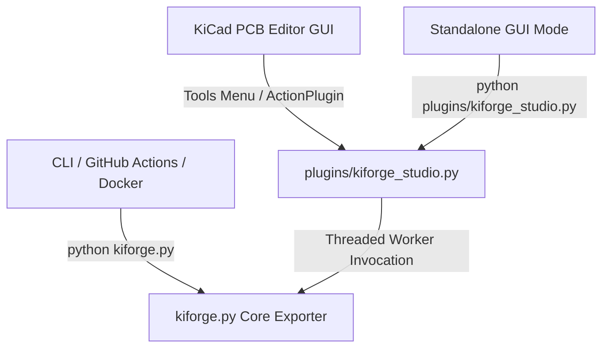
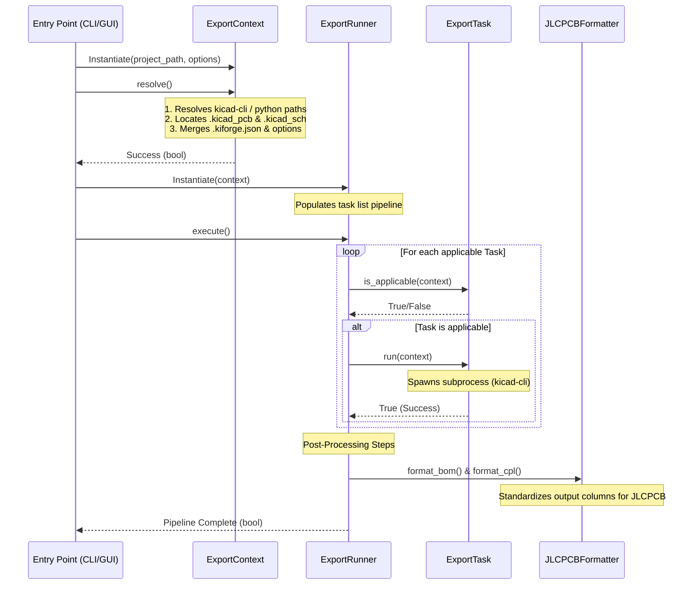

# KiForge Architecture & Developer Guide

This document describes the internal architecture of **KiForge**, its design patterns, processing lifecycle, and execution pipeline. It is intended for developers who wish to modify, extend, or debug the exporter.

---

## 1. System Overview

KiForge is designed as a unified manufacturing and documentation exporter for KiCad 10 projects. It operates under a single-source-of-truth model, where a single core Python module (`kiforge.py`) contains all resolution, validation, task formatting, and CLI parsing logic.

There are three primary entry points into the system:



1. **KiCad GUI ActionPlugin**: Invoked via `plugins/kiforge_studio.py` within the KiCad PCB Editor. It runs the export pipeline in a background worker thread while providing a modal, responsive `wx.ProgressDialog` on the main GUI thread.
2. **Standalone GUI Mode**: Runs as a standard desktop application for local testing when launched directly.
3. **CLI & CI/CD Composite Action**: Run headlessly in terminal environments or inside Docker containers (such as the official `kicad/kicad:10.0` container) in GitHub Actions pipelines.

---

## 2. Design Patterns & Principles

KiForge is structured using seasoned object-oriented design patterns to keep the exporter clean, extensible, and robust:

### A. Command / Task Pattern (`ExportTask`)
Each export step (e.g., Gerber generation, drill plotting, BOM formatting) is isolated into a subclass of the abstract `ExportTask`. 
* **Single Responsibility**: Each task defines only how to check its own applicability and how to run its specific exporter command.
* **Separation of Concerns**: Task orchestration is decoupled from execution details, making it trivial to add or disable new export tasks.

### B. Context Object Pattern (`ExportContext`)
All execution state—such as resolved executable paths, project files, user-supplied option flags, the structured logger instance, and the thread-safe process lock—is encapsulated in a single `ExportContext` instance.
* **Thread-Safety**: Prevents mutable globals from colliding across multiple executions in the same KiCad process.
* **Traceability**: All tasks query the context object to resolve output directories or inspect state.

### C. Facade Pattern (`run_export`)
The `run_export` function acts as a backwards-compatible facade that accepts configuration parameters or an `ExportContext` and routes execution through the OOP `ExportRunner` pipeline.

---

## 3. The Execution Lifecycle

The execution of a KiForge run follows a deterministic, sequential lifecycle:



### Phase 1: Context Resolution
The `ExportContext.resolve()` method performs all environment discovery:
1. **Executable Resolution**: Finds `kicad-cli` and `kicad-python` (with `pcbnew` bound) standard paths across Windows, macOS, and Linux using `PathResolver`.
2. **File Discovery**: Recursively searches the `project_path` to find `.kicad_pcb`, `.kicad_pro`, and `.kicad_sch` files.
3. **Settings Merging**: Loads project-local `.kiforge.json` settings and merges them with run-time command flags (command line or GUI).
4. **Environment Setup**: Configures environment variables (`PYTHONPATH` and `PATH`) to ensure third-party site-packages and KiCad binaries are accessible.

### Phase 2: Pipeline Initialization
`ExportRunner` builds an ordered task pipeline consisting of two parts:
1. **CLI Core Exporters**: Runs `kicad-cli` commands to generate raw Gerbers, drills, positions, BOMs, schematic PDFs, STEP models, 3D renders, SVGs, and Interactive HTML BOMs.
2. **Post-Processors**: Packages raw Gerber and drill outputs into a clean `.zip` archive, filters out DNP components from the BOM, resolves LCSC part numbers, and aligns component placement orientations using custom offsets.

### Phase 3: Task Execution & Subprocess Tracking
Each task executes its logic inside `run()`, typically invoking `_run_subprocess()`.
* **Process Tracking**: The spawned `subprocess.Popen` object is atomically assigned to `context.active_process` under a thread lock (`context._lock`).
* **Output Redirection**: Subprocess `stdout` and `stderr` are read and written to the structured logger (`kiforge.log`) at the `DEBUG` level for traceability.

---

## 4. Thread-Safe GUI Background Processing

Running heavy CLI export processes directly on a GUI thread freezes the window manager, leading to "Not Responding" application hangs. KiForge Studio solves this by splitting GUI polling and worker threads safely:

* **Background Worker Thread**: Invokes `kiforge.run_export(context)` and runs the pipeline.
* **Progress GUI Thread**: Polls `state['running']` status and updates `wx.ProgressDialog` on the main thread via `wx.SafeYield()`.
* **Thread-Safe Cancellation**: If the user clicks "Cancel" on the progress dialog, the GUI thread calls `context.cancel()`. The worker thread checks `context.is_aborted()` at each task boundary, locks `context._lock`, and terminates/kills the active `subprocess.Popen` instance immediately.

---

## 5. Standalone & KiCad Environment Bridging

KiCad's internal scripting environment has unique constraints:
* **Conditional Class Definition**: Action plugins must extend `pcbnew.ActionPlugin`. However, when importing classes for unit tests or running in standalone mode, `pcbnew` is unavailable. KiForge resolves this dynamically:
  ```python
  _PluginBase = pcbnew.ActionPlugin if has_pcbnew else object

  class ExporterPlugin(_PluginBase):
      ...
  ```
* **Safe Import Registration**: The plugin registration hook must run only when KiCad scans python files on startup. To prevent C++ assertions when running tests or CLI, `plugins/__init__.py` utilizes a strict environment check:
  ```python
  if 'pcbnew' in sys.modules:
      from .kiforge_studio import ExporterPlugin
      ExporterPlugin().register()
  ```

---

## 6. JLCPCB Standardizations

### BOM Filtering (`JLCPCBFormatter.format_bom`)
* Ignores components marked with `DNP` (Do Not Populate) fields.
* Standardizes columns into: `Designator`, `Comment`, `Footprint`, `LCSC`, and `Quantity`.
* Automatically maps multiple common custom field names (e.g. `LCSC Part #`, `JLCPCB Part`) to the unified `LCSC` column.

### CPL Rotation Offsets (`JLCPCBFormatter.format_cpl`)
* Converts raw position layouts into `Designator`, `Mid X`, `Mid Y`, `Layer`, and `Rotation`.
* Downstream manufacturers like JLCPCB use standard component feeders that require specific rotational alignment relative to KiCad's CAD layout orientation.
* KiForge merges footprint package patterns and component designators with a dictionary of target rotational offset values (loaded dynamically from `.kiforge.json`) to adjust the output rotation cleanly before shipping:
  ```python
  # Applies the offset matching component packages
  rotation = (rotation + offset) % 360.0
  ```
